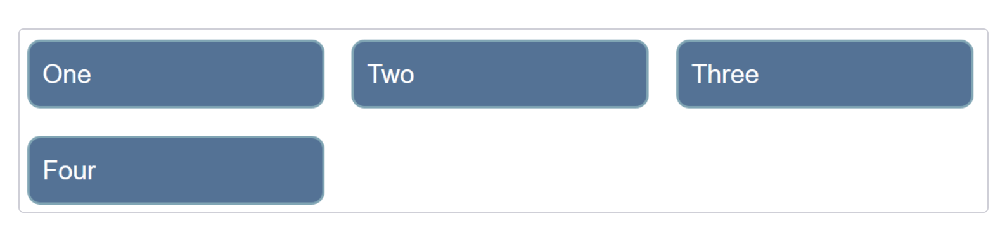
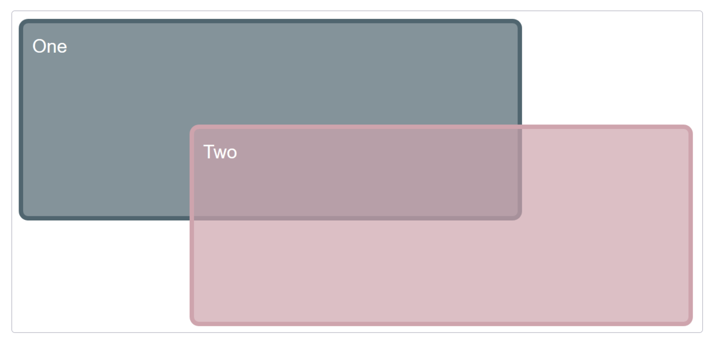
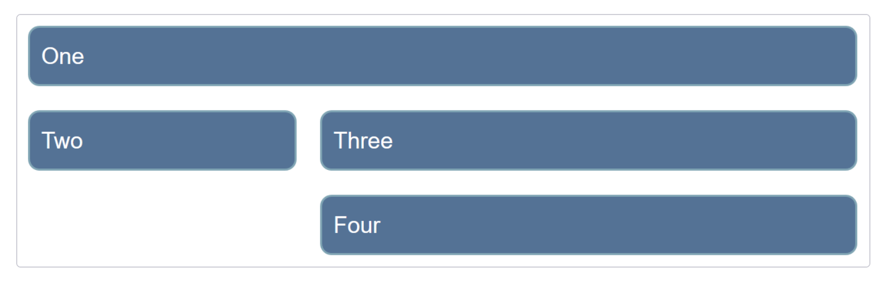
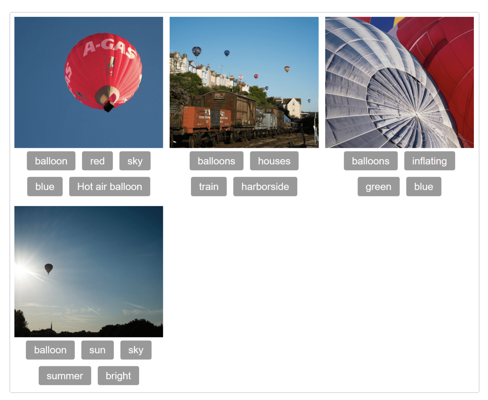

# CSS Grid Challenge

For this challenge you need to use CSS Grid Layout to build each of the following exercises.

In the `index.html` you can find the base html for each excerise and in `styles.css` the base styles.

Your job is to adjust the code provided in order to reach the UI required by each exercise.

## Exercise 1

Create a grid into which the four child elements will auto-place. The grid should have three columns sharing the available space equally, and a 20px gap between the column and row tracks.

The finished example should look like the image below.

## Exercise 2

By editing the CSS rules for the two child elements (items), cause them to span over several grid tracks each; the second item should overlay the first as in the image below.

## Exercise 3

In the code provided, you can find a grid with four direct children. The starting point has them displayed using `auto-placement`. Use the `grid-area` and `grid-template-areas` properties to lay the items out as shown in the image.

## Exercise 4

You will need to use <b>both</b> CSS Grid and Flexbox to recreate the example as seen in the image below. You do not need to make any changes to the provided HTML in order to do this, just to the styles.

# What's expected

1. You should modify the code provided to build the UI asked in each exercise.
2. All exercises should be solved by using CSS Grid Layout.

# Objective

The purpose of this challenge is to get you working with CSS Grid Layout, and test that you understand how a grid and grid items behave.
